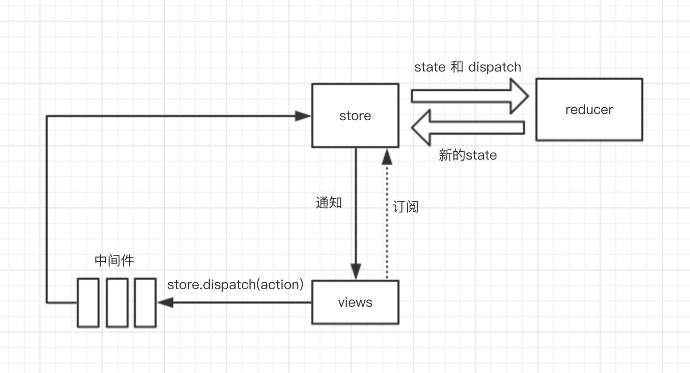

## 前言
一直使用的是Vue，最近想学习一下 `react`, 相比于Vuex，我感觉 redux 理解起来对于新手来说有点难， 反正刚学的时候绕晕了。`Redux 是一个 JavaScript 应用状态管理的库`, 为了解决单页面应用越来越复杂的数据处理。
- 看一下下面这张思维导图



简单的理解就是： 创建唯一的 `store（仓库）`，一些`view（工人）`要向 `store（仓库）`索取`data（货物）`，`view（工人）`先向`store（仓库）`递交`action(dispatch)（申请书）`，然后 `store（仓库）`收到申请书后，再查看`reducer（管理系统）`查看是否存在这个`data（货物）`，找到`data（货物）`之后，返回给`view（工人）`

### redux的一些注意事项
- 1. 单一数据源 整个应用的数据。 存储在同一 `store` 中，
- 2. 只读`state`。 store 向 reducer 传递 state和dispatch ,返回的是新的state
- 3. 使用纯函数执行修改 （函数在有相同的输入值时，产生相同的输出， 并且函数中不包含任何会产生副作用的语句）

## store

- 首先创建 store [完整例子也可以看github](https://github.com/hz199/__react-admin-zh-redux/tree/master/src/redux)

```js
// store.js
import { createStore, compose, applyMiddleware } from 'redux'
import rootReducer from './reducers'
import reactThunk from 'redux-thunk'

// 创建 tore 引入 redux devtools
const composeEnhancers = window.__REDUX_DEVTOOLS_EXTENSION_COMPOSE__ || compose
// createStore 使用 reactThunk 中间件
const store = createStore(rootReducer, composeEnhancers(applyMiddleware(reactThunk)))

export default store
```

```js
import { combineReducers } from 'redux'
// 和home 相关的 reducer
import { homeReducer } from './modules/home'
//  combineReducers 是的 reducer 函数拆分 
export default combineReducers({
  home: homeReducer
})
```

## Action

- `action` 是一个描述事件的简单对象, `type` 字段来表示将要执行的动作, 除了 `type` 字段外，`action` 对象的结构完全不限制。

```js
  // actionTypes.js
  export const AXIOS_TEST_DATA = 'home/AXIOS_TEST_DATA'

  // actionCreators.js
  import * as actionTypes from './actionTypes'

  export const axiosTestData = (data) => ({
    type: actionTypes.AXIOS_TEST_DATA,
    data
  })
```
- redux 如果想要处理异步事件，就要使用到 `redux-thunk`, 若使用了`reduxThunk` action 不仅仅支持简单对象了， 同时还可以返回一个函数

```js
// axiosTestData 上面的函数 返回一个 js 对象，这个返回一个函数处理异步请求 （AJAX）

export const getTestData = () => {
  return (dispatch) => {
    testServices.testApi().then(res => {
      dispatch(axiosTestData(res.data))
    })
  }
}
```

## Reducer 

```js
const defaultStore = {
  test: 11
}

/**
 * home store
 * @param [state]
 * @param [action]
 * @return 新的 home store
 */

const homeReducer = (state = defaultStore, action) => {
  switch (action.type) {
    case actionTypes.BTN_CLICK:
      // 这里是返回一个新的 对象并非原 state
      return {
        test: 22
      }
    default:
      return state
  }
}
```

## 容易组件中使用

- `connect` 真正连接 Redux 和 React，它包在我们的容器组件的外一层，它接收上面 Provider 提供的 store 里面的 state 和 dispatch，传给一个构造函数，返回一个对象，以`props`形式传给我们的容器组件

```js
import React from 'react';
import { Button } from 'antd';
import { connect } from 'react-redux'
import './App.less'

import { actionCreators } from './redux/modules/home'

function App(props) {
  return (
    <div className="App">
      <Button type="danger" onClick={props.buttonClick}>Danger</Button>
      <p>{props.test}</p>
    </div>
  );
}

// 把redux 里面的数据映射到 props
const mapStateToProps = (state) => {
  return {
    test: state.home.test
  }
}

// dispatch 映射到props
const mapDispatchToProps = dispatch => {
  return {
    buttonClick () {
      dispatch(actionCreators.buttonClick())
    }
  }
}

export default connect(mapStateToProps, mapDispatchToProps)(App)
```

## 使用redux-immutable统一数据格式

- Immutable Data 就是一旦创建，就不能再被更改的数据

上面的`reducers.js` 创建 reducer 函数拆分 的 combineReducers， 可以换成 
```js
import { homeReducer } from './modules/home'
import { combineReducers } from 'redux-immutable'
// 创建的 reducer store  就是一个 immutable 数据 
export default combineReducers({
  home: homeReducer
})
```

修改 state 里面的数据
```js
const homeReducer = (state = defaultStore, action) => {
  switch (action.type) {
    case actionTypes.AXIOS_TEST_DATA:
      return state.set('testAxiosData', action.data)
    default:
      return state
  }
}
```
获取state 数据
```js
const mapStateToProps = (state) => {
  return {
    // state.get('home').get('testAxiosData')
    testAxiosData: state.getIn(['home', 'testAxiosData'])
  }
}

```